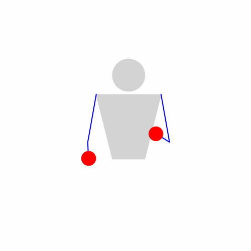

# Juggling Control Suite (JCS)

## Simulator
This is a simplified 2D juggling simulation for vanilla site-swaps.
There are four degrees of freedom at the elbows and hands.
Two angular forces can "turn" the elbows,
and two discrete controls can open and close the hands.

By calling `step` on the simulator, we advance the state.
The state is as follows:

**body state** (this is what the controls act upon):
* `hold_l`, `hold_r`: boolean, whether left and right hand are closed
* `elbow_l`, `elbow_r`: angle of left and right elbow
* `d_elbow_l`, `d_elbow_r`: change in angle of left and right elbow

**ball state** (for each ball):
* `pos`: ball position (x,y)
* `vel`: ball velocity (dx, dy)
* `beat`: beat count at time when ball was thrown
* `dwell`: 0 for left, 1 for right hand, -1 if the ball is in the air
* `origin`: whether the ball was thrown from left or right hand
* `height`: at which height the ball is thrown

**simulation state**:
* `beat`: counter for throws
* `catches`: counter for catches

### Throwing, Flying, Catching
1. a ball that is thrown when it is in hand and the hold is released
2. it takes the tangential velocity of the hand and underlies gravity, thus the trajectory is a parabola
3. a ball is caught if it enters a tolerance radius of the catching hand, then it takes its velocity immediately

### Some technicalities
* left and right are as seen from the front, not from the juggler's perspective
* the elbow angle $\theta$ is measured from the bottom most position of the hand, where $\theta = 0$
* the elbow angle $\theta < \pi$ for inside angles (i.e. right for left hand, and left for right hand) and $\theta > \pi$ for outside angles, such that the same values can be used for left and right hand

## Agent
Agents have a `control` function which generates the discrete and continuous controls:
* `hold_l`, `hold_r`: boolean, sets the left/right hands to open/closed states
* `dd_elbow_l`, `dd_elbow_r`: $\in [-1, 1]$, ac/de-celerations to left/right elbow

### Optimal agent
The optimal agent is hardcoded, it has a lookup table for when to do what:
* it throws at specific angles $\theta_h$ and with specific angular velocity $\omega_h$ for different heights $h$ of a throw
* TODO for $\theta < \pi$ it accelerates, for $\theta > \pi$ it decelerates